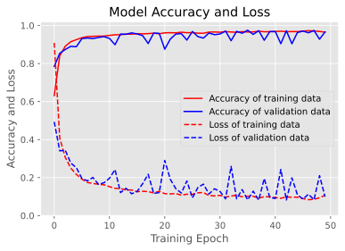
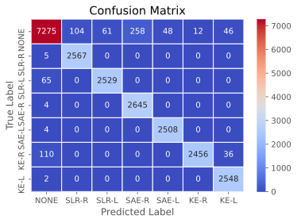

# Activity Recognition Using MLP

This project aims to classify six lower limb activities point by point using 3 axes accelerometers and gyroscopes embedded in wearable sensors. The MLP model of deeplearning is implemented to recognition and classification.

**Lower limb activity**
* right-side straight leg raise (SLR-R)
* left-side straight leg raise (SLR-L)
* right-side short-arc exercise (SAE-R)
* left-side short-arc exercise (SAE-L)
* right-side knee extension (KE-R)
* left-side knee extension (KE-L)

**Sensor**
* **6** OPAL inertial measurement units (published by [APDM](https://apdm.com/wearable-sensors/), Portland, USA)
* **128 Hz** sampling rate
* 6 sensors are attached to the _chest_, _waist_, _both thighs_, and _both shanks_


## Requirement
Tensorflow and Python 3 environment. Using Anoconda to install packages is recommanded.

## Methodology
Execute file in `AR.ipynb` which is a jupyter file
### Load and preprocess data
* Load data ( `read_label_data` in `LPdata.py` )
* Labeling
```
NONE - 0
SLR(R) - 1
SLR(L) - 2
SAE(R) - 3
SAE(L) - 4
KE(R) - 5
KE(L) - 6 
```
* Normalise
```python
def normalise(n, maxNum, minNum):
    return (n - minNum) / (maxNum - minNum)
```
* Split data into training set and testing set **(9:1)**
```python
from sklearn.model_selection import train_test_split

train, test = train_test_split(data, test_size=0.1)
```
### Construct neuron network model
* Build Keras MLP ( `MLP.py` )
```python
import tensorflow as tf

class MLP(tf.keras.Model):
    def __init__(self):
        super().__init__()
        self.denseIn = tf.keras.layers.Dense(units=100)
        self.dense = tf.keras.layers.Dense(units=100, activation=tf.nn.relu)
        self.denseOut = tf.keras.layers.Dense(units = 7)
        # Output class = 6 + 1(other)

    def call(self, inputs):
        x = self.denseIn(inputs)
        x = self.dense(x)
        x = self.dense(x)
        x = self.denseOut(x)
        outputs = tf.nn.softmax(x)
        
        return outputs
```
### Validate results
* Loss function line plot


* Confusion Matrix




